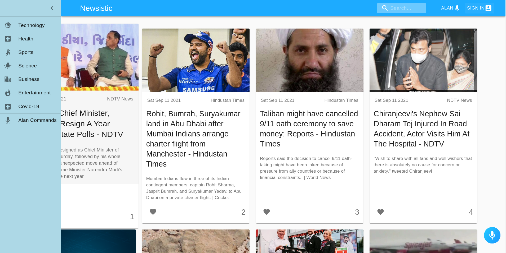

# Newsistic

A interesting way to remain updated with the happenings around the world with your virtual assistant Alan. You can ask Alan any kind of news you want and also bookmark the news you like or want to read it later.
<br/>

### **Click on link below to view its amazing features .**

# [Full Project Demo](https://www.linkedin.com/posts/raj-gautam-024369201_webdeveloper-newsalert-reactdeveloper-activity-6841978327721369600-eLkH/)

## Snapshots of the Hosted Project

> ### 

> ### 

> ### 

> ### 

## Overview

- ### Pages:

  - **Home Page**

    - It shows lastest news and a header containing various buttons
    - A sidebar containing different categories.

  - **Commands Page**:

    - Show all the commands needed to Search news.

  - **SignIn Page**

    - Sign in and Sign up options
    - New user can use Sign up to sign in through Email and Password.
    - Sign in with Google button.

## **Starting the Dev Server**

- Clone the repository to your local system. `https://github.com/rajgautam-cloud/newsistic`

- Firebase API Setup:

  1.  Go to [Firebase Console](https://console.firebase.google.com) and follow the steps to create a new Firebase project.
  2.  Select `</>` , _Add a project via Code_.

  3.  Create a new web app using the steps provided on the console.

  4.  You will recieve a firebasConfig object with the first paramter as API key. Copy it, which will look something like:

      ```js
              cosnt firebaseConfig = {
              apiKey: "process.env.REACT_APP_FIREBASE",
              authDomain: "AUTH_DOMAIN",
              projectId: "PROJECT_ID",
              storageBucket: "STORAGE_BUCKET",
              messagingSenderId: "*************",
              appId: "******************************",
              measurementId: "*************"
            };
      ```

  5.  After you get the Firebase API key, create a .env file in the root folder of the repository

  6.  Insert the folowing snippet in the file

           REACT_APP_FIREBASE="API_KEY_HERE"

- News API Setup:

  1.  Go to the following link and set up a new project from <https://newsapi.org//>

  2.  Get the Api key

  3.  A new API key will be generated. Copy it in the .env file.

               REACT_APP_NEWSAPI="API_KEY_HERE"

- Ensure that .env is added in .gitignore file.

- In the root folder and enter the following commands in the CLI

          npm i or yarn
          npm start or yarn start

- If you wish to contribute, either look for issues already created or create an issue if you have a new idea.
  <br/>
